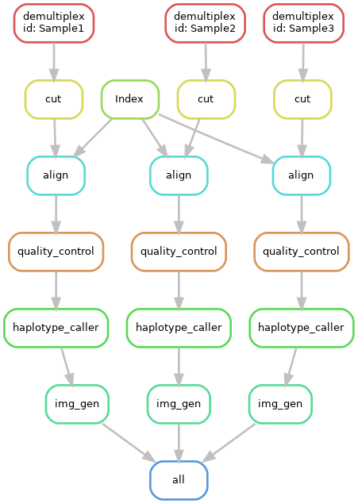
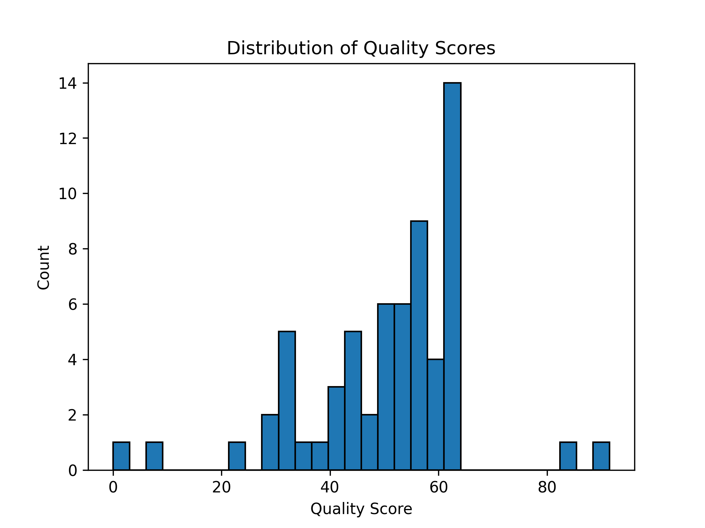

# Revised Fast-GBS Pipeline.

## Introduction

This project is dedicated to the revision of an existing
pipeline for the analysis of GBS data. The original pipeline was created by
[Jerlar73 in this repo.](https://bitbucket.org/jerlar73/fast-gbs/wiki/Home) 
The [relevant paper](https://bmcbioinformatics.biomedcentral.com/articles/10.1186/s12859-016-1431-9)
for the original pipeline further describes its functionality.
This new version of the pipeline aims to streamline the process from shell and python 
scripts to a single snakemake pipeline. In addition to the original functionality of 
the previous pipeline, this new version also includes the ability to generate a .png 
file at the end. This file shows the quality scores and their distribution of 
the samples the user provides. 

The following image shows the workflow of the pipeline (When using 3 samples):

<p align="center">
  
</p>


This DAG results in the last rule of the pipeline, 
which is the generation of the .png file with quality score displays.

<p align="center">
  
</p>

## Installation
Clone the repository and open a terminal in the cloned directory.
Then run the following command to create the mamba environment:

```bash
mamba env create -f environment.yml
```

This will create a mamba environment called `fgbs` with all the necessary dependencies.

## Usage
After the environment is created, activate it with the following command:

```bash
conda activate fgbs
```

After creating the environment, the user must change the config.yaml file to fit their needs.
The user must change the following parameters: 
1. fr (Forward Read, FASTQ)
2. rr (Reverse Read, FASTQ) 
3. Reference (Reference file, FNA.)
4. Barcodes (Barcodes file, TXT.)
5. Adapter (Adapter file, FASTA.)
6. Qual (Quality score, INT.)
7. Readlen (Read length, INT.)
8. Minreads (Minimum number of reads, INT.)

Then run the following command to run the pipeline:

```bash
snakemake --cores <number of cores>
```

Do make sure you are in the cloned directory when running the above commands.

### Snakemake Pipeline

The pipeline contains a total of 6 rules.
The first rule is the `all` rule, which is the first rule to be executed. Which is used
to execute the entire pipeline. 

The second rule is the preprocessing rule, which indexes
the reference files using `bwa index`.

The third rule is the demultiplexing rule,
which uses `fastq multx` to demultiplex the provided forward and reverse reads.

The fourth rule is the cut adapters rule, which uses `cutadapt` to remove the adapters from the demultiplexed
sample files.

The fifth rule is the alignment rule, which uses `bwa mem` to align the trimmed sample files

The sixth rule is the postprocessing rule, which contains multiple steps. 
The first step is the quality control action, which uses `samtools view` 
for quality control. This step also converts the .sam file to a .bam.

The second step is the haplotype caller action, which uses `gatk HaplotypeCaller` to
call the haplotypes of the samples. This results in a .vcf file.

The third and final step is the generation of the .png file. This step uses `imggen.py` to
generate a .png file with the quality scores and their distribution of the samples.

## Output Interpretation
The end result of the pipeline are two files. The first file is a .vcf file, which contains
the haplotypes of the samples. The second file is a .png file, which containss graphs showing the
quality score distribution of the sample(s). Both can be found in the 'final' directory under the output directory.

This is an earlier example of the .png file, which shows the distribution of the quality scores of a dummy sample.

<p align="center">
  
</p>